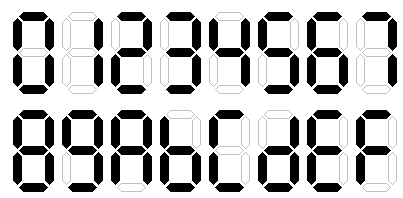
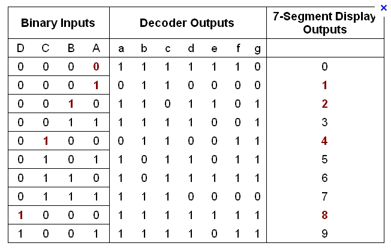
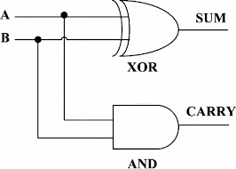
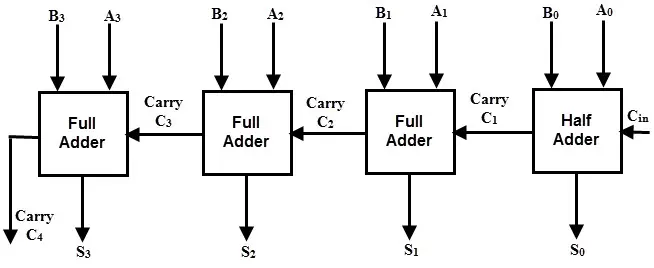

Nesse texto pretendo dar uma introdução à implementação de circuitos
lógicos simples, implementando os componentes de uma unidade lógica e
aritmética, com um extra de um tutorial para implementação desses 
circuitos em
[FPGAs](https://pt.wikipedia.org/wiki/Arranjo_de_porta_program%C3%A1vel_em_campo),
dando uma  atenção exclusiva aos modelos Cyclone IV e V da Altera, e fazendo toda a implementação no ambiente Intel Quartus Prime.

Os únicos pré-requisitos do texto são: conhecer as operações
aritméticas que vamos implementar (isso eu não irei revisar) e ter
noções básicas de álgebra booliana. Sobre o último, farei uma breve
(re)visão no começo do texto e vou explicando coisas mais particulares
conforme for necessário.

A abordagem comicamente específica e estranha desse texto se dá
pelo fato de que esse texto foi escrito *especialmente* para servir de
material auxiliar para os alunos do curso de Prática em Lógica
Digital, então todas as seções desse texto estão *necessariamente*
associadas a um trabalho/aula do curso. Por esse mesmo motivo escolhi
considerar algumas noções de lógica digital como pré-requisito, já que
o curso de Introdução à Lógica Digital é dado simultaneamente a esse.
Se você não está fazendo esse curso e caiu aqui de paraquedas,
provavelmente não vai gostar muito desse texto, então recomendo o
[blog do Coert
Vonk](https://coertvonk.com/category/hw/building-math-circuits) sobre
o assunto, alguns vídeos do [Ben Eater](https://www.youtube.com/watch?v=wvJc9CZcvBc)
no YouTube e o [Stephen Brown, Fundamentals of Digital
Logic](https://www.amazon.com/Fundamentals-Digital-Logic-Verilog-Design/dp/0073380547),
que vai bem além desse assunto.

Ressalva relevante: muitos dos projetos pedidos na disciplina do 
laboratório (além de uma porção boa da teoria) são explicados em vídeos 
gravados durante a pandemia pelo professor Denis Wolf. Recomenda-se
fortemente a visualização de seus vídeos durante o 1° semestre, por
fornecerem uma base muito boa em Lógica Digital e suas aplicações.
Link [aqui](https://youtube.com/playlist?list=PL400nT9WA9li9LjGXqFKlHqRZxryRAomV)

**Importante:** Todas as seções têm partes marcadas com **(!)**.
Isso indica que essas partes explicam um pouco mais profundamente
sobre aquele assunto/problema. Para os desesperados:
podem pular esses parágrafos e seguir o texto como um tutorial
"passo-a-passo" de como montar os circuitos (ainda assim, recomendo
muito que não ignore até a seção 5).

Finalmente, números em base binária serão escritos com o prefixo $0b$,
números em base hexadecimal serão escritos com o prefixo $0x$ e
números em base decimais serão escritos sem prefixo.

Enfim, enjoy it!

# Conteúdo

0. [Pré-requisitos](#pré-requisitos)
1. [Configuração do Quartus Prime](#configuração-do-quartus-prime)
2. [Simplificação de Expressão Lógica](#simplificação-de-expressão-lógica)
3. [Modelagem de Problema Prático](#modelagem-de-problema-prático)
4. [Modelagem de Problema Prático 2: Electric Boogaloo](#modelagem-de-problema-prático-2-electric-boogaloo)
5. [Display Hexadecimal de 7 segmentos](#display-hexadecimal-de-7-segmentos)
6. [Half Adder](#6-half-adder)
7. [Somador de 4 bits](#7-somador-de-4-bits)

## 0. Pré-requisitos **(!)**

O que se tem para falar de pré-requisito aqui é basicamente
o que é dado no início do curso de Introdução à Lógica Digital
(essencialmente, o básico de álgebra booliana). Então aí vai uma
introduçãozinha.

Basicamente, a álgebra booliana que vamos precisar aqui é basicamente
um conjunto de regras que vale pra algumas operações no conjunto
$\{0,1\}$. Durante esse texto, muitas vezes um valor desse conjunto
será chamado de *bit* (binary digit). Essas regras são definidas de 
modo a juntar as principais propriedades de operações entre conjuntos,
no caso, união, interseção e complemento. No contexto de lógica digital, 
é mais comum usar os conectivos lógicos pra se referir a estas operações,
usando *OU/OR* para união, *E/AND* para interseção e *NÃO/NOT* para complemento.

As duas coisas são equivalentes porque a união de dois conjuntos $A$ e
$B$ é o conjunto dos elementos que pertencem a $A$ **ou** a $B$, não
exclusivamente (ou seja, o elemento pode pertencer aos dois), a
interseção entre $A$ e $B$ é o conjunto dos elementos que pertencem a
$A$ **e** a $B$ e o complemento de um conjunto $A$ é o conjunto dos
elementos de um conjunto universo que **não** pertencem a $A$. Durante
todo o texto vamos usar o símbolo $+$ pra representar a operação *OR*
e o símbolo $\cdot$ pra representar a operação *AND*. O complementar
de um valor $a$, ou seja, um valor aplicado na operação *NOT* vai ser
denotado por $\overline{a}$.

A seguir estão as principais regras das operações citadas (você vai
encontrar isso em qualquer livro de lógica digital):

1. Se $x=0$, então $\overline{x}=1$
2. Se $x=1$, então $\overline{x}=0$

Para $x$ sendo $0$ ou $1$:

1. $x \cdot 0 = 0$
2. $x + 1 = 1$
3. $x \cdot 1 = x$
4. $x + 0 = x$
5. $x \cdot x = x$
6. $x + x = x$
7. $x \cdot \overline{x} = 0$
8. $x + \overline{x} = 1$
9. $\overline{\overline{x}} = x$

E note que pra toda regrinha desse tipo, você pode
trocar $0$ por $1$, $\cdot$ por $+$ e vice-versa e a regra continua
valendo. Isso é o princípio de dualidade.

Além dessas regras, as operações são comutativas (a ordem dos fatores
não importa) e também são associativas (não importa onde você coloca
os parênteses). E também são distributivas, mas diferente de números
reais, a soma também distribui sobre o produto, ou seja, pra todos os
$x$, $y$ e $z$ sendo $0$ ou $1$, vale tanto $x \cdot (y+z) = x \cdot y + x
\cdot z$ quanto $x+(y \cdot z) = (x+y) \cdot (x+z)$.

Pra terminar, vão aí algumas últimas regras menos óbvias que podem ser
úteis:

1. $x+x \cdot y = x$ (Absorção)
2. $x \cdot y + x \cdot \overline{y} = x$ (Combinação)
3. $\overline{x \cdot y} = \overline{x} + \overline{y}$ (DeMorgan)
4. $x \cdot y + y \cdot z + \overline{x} \cdot z = x \cdot y +
\overline{x} \cdot z$ (Consenso)

E não esqueça que pra cada uma dessas existe uma equivalente trocando
$+$ por $\cdot$ e vice-versa.

Esse modelo matemático é útil pra projetar circuitos digitais porque
você vai trabalhar com sinais binários (se atribui os símbolos 0 e 1 a
eles, por convenção), e o que se tem para trabalhar são as portas
lógicas, que são basicamente componentes eletrônicos que tem o
comportamento dessas operações que acabamos de ver.

Dessas portas lógicas mais básicas se pode criar outras portas lógicas
úteis em várias situações, por exemplo, a *XOR* (OU-exclusivo), que é
definida por $x \oplus y = \overline{x} \cdot y + x \cdot
\overline{y}$. Vamos usar bastante essa porta lógica.

A ideia de termos esse modelo matemático é poder modelar uma solução
pra um problema usando funções boolianas, que são basicamente arranjos
dessas operações que definimos em um número qualquer de variáveis para
termos uma ou mais saídas que resolvem o problema. Com as propriedades
das operações podemos simplificar essas funções, de modo a usar menos
portas lógicas pra obter a mesma saída para as funções. Mais para
frente vamos usar métodos mais eficientes pra simplificar funções
boolianas (poderemos garantir que a função vai terminar o mais
simplificada possível).

Como usar o modelo da lógica booliana para abordar problemas? Segue
um algoritmo básico de como navegar essa abordagem.

Inicialmente, o que você deve fazer é separar inputs de 
outputs, aka o que entra e sai, respectivamente. Cada um deles deve 
ser considerado como um bit; por exemplo, se $A$ é um input, ele pode
assumir $A = 1$ ou  $A = 0$.  Então, o que resta é achar as relações 
lógicas entre inputs e outputs (dadas pelas portas) as quais validam
nosso modelo. Para tal, a ferramenta mais básica é a tabela-verdade.

Tabelas-Verdade (TV's para os íntimos) são tabelas em que as colunas
indicam nossas variáveis, e as linhas, os possíveis valores que 
as variáveis podem assumir. Seguimos a seguinte fórmula para montagem:
$l = 2^{i}$, sendo $l$ o número de linhas, e $i$, o n° de inputs.
Essa fórmula advém do fato de que cada input pode assumir $1$ ou $0$.
A sua lógica de implementação acontecerá nos outputs, onde você decidirá
como o circuito responderá a cada combinação de inputs possível, podendo
ser $1$, $0$, ou $X$ = Don't Care (tanto faz $0$ ou $1$). Sendo $T$ uma 
sequência dividida em 2 por $0$'s e $1$'s que começa com $T = l$, o padrão
é, a cada input novo, dividir $T$ por $2$ e repeti-lo até preencher $l$.
Segue um exemplo de uma TV e o circuito correspondente:

onde $T$ reduz entre $A,B,C$ para $8,4,2$, respectivamente. É importante
sempre seguir esse padrão. Agora que você já sabe como concretizar 
problemas a esse tipo de lógica, fica a pergunta: como eu tiro um 
circuito de uma TV? Para isso, os 2 métodos passados na disciplina são:
simplificação algébrica (terrível), e mapa-de-Karnaugh (preferível).
Exibiremos como fazer ambos nas seções seguintes.

## 1. Configuração do Quartus Prime

(fazer)

## 2. Simplificação de Expressão Lógica

Um primeiro exemplo de simplificação de função booliana é o da
seguinte expressão:

\begin{equation}
	Q(A,B,C) = \left(A \cdot B\right) + \left((B+C)\cdot(B\cdot C)\right)
\end{equation}

Na forma que está, essa função quando implementada precisaria de $5$
portas lógicas, mas é possível fazer algumas manipulações algébricas
para simplificá-la.

A partir de agora, usaremos a notação $AB = A \cdot B$.

Imediatamente, pela distributividade do produto
sobre a soma, ficamos com $AB + BBC + BCC$,
que automaticamente simplifica pela propriedade "$xx = x$" para
$AB+BC+BC$, e analogamente, pela proriedade 
"$x + x = x$", simplifica finalmente para
\begin{equation}
	Q(A,B,C) = AB+BC = B(A+C) 
\end{equation}
utilizando agora somente $2$ portas lógicas.

Na figura acima está o a função $Q$ implementada com as portas lógicas
na forma de diagrama de blocos. O circuito que leva à saída *OUTPUT1* 
está na forma não-simplificada (leva $5$ portas lógicas), enquanto o circuito
que leva à saída *OUTPUT2* está na forma simplificada (leva $2$ portas
lógicas).

## 3. Modelagem de Problema Prático

Já que na hora de resolvermos problemas reais usando circuitos lógicos
não teremos inicialmente uma função booliana, mas sim um problema a
analisar para transformarmos numa expressão lógica, vamos tentar
implementar um circuito que resolve o problema de criar um sistema de
controle de um reservatório de água.

O reservatório é modelado da seguinte maneira: ele possui $3$
sensores, $3$ válvulas e $1$ alarme.
Denotaremos os sensores por $S_0$, $S_1$ e $S_2$, as válvulas por
$V_1$, $V_2$ e $V_3$ e o alarme por $A$.
Disso já podemos inferir que o
sistema possui $3$ entradas (sinais dos sensores) e $4$ saídas
(controle das válvulas e alarme). Além disso, o comportamento das
entradas e saídas devem satisfazer as seguintes condições:

- A válvula $V_1$ deve ser acionada quando o sensor $S_1$ indicar
  presença de água;
- A válvula $V_2$ deve ser acionada *somente* quando os sensores
  $S_1$ e $S_2$ indicarem a presença de água;
- A válvula $V_3$ deve ser acionada *somente* quando *nenhum* dos
  sensores indicar a presença de água;
- O alarme $A$ deve soar quando $S_1$ indicar presença de água sem
  $S_0$, ou quando $S_2$ indicar presença de água sem $S_1$ e/ou
  $S_0$.

Logo podemos ver que a válvula $V_1$ é a mais simples, já que ela deve
ser acionada incondicionalmente quando o sensor $S_1$ estiver com
sinal ativo. Então já podemos dizer que $V_1=S_1$, o que é a mesma
coisa de só conectar um fio direto do sensor $S_1$ na válvula $V_1$.

Já para a válvula $V_2$ ser ativada, é necessário que ambos os
sensores $S_1$ e $S_2$ estejam ativos, ou seja, $V_2 = S_1 S_2$.

Para a válvula $V_3$, é necessário que todos os sinais dos sensores
estejam desativados, então ficamos com $V_3 =
\overline{S_0}\,\overline{S_1}\,\overline{S_2}$. Pelo Teorema de
DeMorgan, também temos $V_3=\overline{S_0+S_1+S_2}$.

Já para o alarme, existem duas situações nas quais o alarme deve ser
ativado: quando $S_1$ estiver ativo e $S_0$ não estiver, isto é,
$\overline{S_0}S_1$, ou então quando $S_2$ estiver ativo e qualquer um
dos $S_0$ e $S_1$ não estiverem, ou seja,
$S_2\left(\overline{S_0}+\overline{S_1}\right)=\overline{S_0 S_1}S_2$.
Finalmente, já que queremos que em qualquer um dos casos o alarme
ative, queremos $A=\overline{S_0} S_1 + \overline{S_0 S_1}S_2$.

E numa situação de emergência, queremos que o reservatório seja
esvaziado, portanto devemos adicionar uma condição extra para a $V_3$,
fazendo-a desativar quando o alarme estiver ligado, e as outras
válvulas devem ativar quando o alarme estiver ligado. Então
sendo $V_1^\prime$, $V_2^\prime$ e $V_3^\prime$ as 
novas funções para as válvulas, temos
\begin{align}
&V_1^\prime = V_1 + A\\
&V_2^\prime = V_2 + A\\
&V_3^\prime = V_3 \overline{A}
\end{align}

Daí ficamos finalmente com o seguinte circuito

(fazer circuito completo)

## 4. Modelagem de Problema Prático 2: Electric Boogaloo

Um segundo problema a ser modelado usando circuitos lógicos é o
comportamento de um robô móvel. O sistema de controle desse robô
possui $3$ sensores, direita, esquerda e frente ($D$, $E$ e $F$,
respectivamente) que ativam quando detectam um obstáculo, e um 
sistema de movimento com $3$ comandos, direita, esquerda e frente
($CD$, $CE$, e $CF$, respectivamente).

O comportamento do robô deve seguir as seguintes regras:

- O robô deve se mover para frente *sempre* que o sensor da frente não
  detectar nenhum obstáculo;
- O robô deve virar à esquerda quando o sensor da frente detectar um
  obstáculo e o da esquerda não;
- O robô deve virar à direita quando existir obstáculo na esquerda e
  não à direita, ou quando houver um obstáculo apenas na frente ou se
  houver um obstáculo na frente, direita e esquerda;

Bem, como a primeira regra explicita que o robô deve ir para a frente
*sempre* que o sensor $F$ não detectar obstáculos, imediatamente já
temos que $CF = \overline{F}$. Para que o robô vá para a esquerda,
primeiramente é necessário que haja obstáculo à frente, para não ferir
a primeira regra. Além disso, deve haver um obstáculo à direita e não
à esquerda. Ficamos com $CE = \overline{E}DF$. Finalmente, para que o
robô vá para a direita, novamente, é necessário que o haja algum
obstáculo à frente, para não ferir a primeira regra.

Para o último controle $CD$, a dedução mais intuitiva da função não é
imediata, então vamos recorrer a outro método para deduzí-la. De
acordo com as regras dadas, segue a tabela verdade que o projeto deve
seguir:

| D | E | F | CD | CE | CF |
|---|---|---|----|----|----|
| 0 | 0 | 0 | 0  | 0  | 1  |
| 0 | 0 | 1 | 1  | 0  | 0  |
| 0 | 1 | 0 | 0  | 0  | 1  |
| 0 | 1 | 1 | 1  | 0  | 0  |
| 1 | 0 | 0 | 0  | 0  | 1  |
| 1 | 0 | 1 | 0  | 1  | 0  |
| 1 | 1 | 0 | 0  | 0  | 1  |
| 1 | 1 | 1 | 1  | 0  | 0  |

Dessa tabela podemos escrever manualmente uma expressão que satisfaz a
coluna $CD$, que é $CD = \overline{D}\,\overline{E}\,F +
\overline{D}\,E\,F + DEF$ (soma de produtos).
Agora podemos simplificá-la. Distribuindo, temos $CD =
\overline{D}\,F\left(\overline{E}+E\right)+DEF$. Daí, temos 
$CD =\overline{D}\,F+DEF$.
Colocando $F$ em evidência, ficamos com $CD =
F\left(\overline{D}+DE\right)$, e agora, pela regra de absorção,
ficamos com $CD = F\left(E+\overline{D}\right)$.

Assim, circuito final fica da seguinte forma:

## 5. Display Hexadecimal de 7 segmentos

Passados os primeiros exemplos de circuitos lógicos, vamos para o
primeiro componente que vamos precisar para exibir os valores
numéricos nos componentes da ULA. A ideia do display hexadecimal de 7
segmentos é converter um número binário da forma $ABCD$ em um dígito
hexadecimal, isto é, um dígito que pode assumir 16 valores (0 até 9 e
então A até F).

Para representar o dígito hexadecimal, usaremos o display de 7
segmentos disponível nas FPGAs Cyclone IV e V. A cada segmento do
display associaremos uma função booliana que leva os dígitos binários
de entrada ao sinal daquele segmento, de modo a desenhar todos os
dígitos hexadecimais. Para atingir esse fim, será construída uma
tabela-verdade com todos os valores possíveis para extrair a expressão
algébrica dela; lembrando que teremos 4 inputs (números de 0 a 15
são representados por 4 bits) e 7 outputs.

(adicionar tabela verdade e explicação do mapa de karnaugh).

Para resolver essa tabela e extrair um circuito, são possíveis 2 
soluções: a primeira é projetar uma matriz de inputs por outputs,
sendo que cada output possui uma logic gate OR que receberá todos os inputs
que ativam-no. A segunda, mais otimizada porém técnica, envolve
usar o método de K-maps (mapa de Karnough), mencionado previamente.

A explicação desse método é um pouco longa e demorada, então vale
mais a pena aqui recomendar a leitura dele no site
[Bê-á-Bá](https://de-abreu.github.io/be-a-ba/) da lógica digital,
desenvolvido por veteranos da 024. Dado que você já tenha lido e
entendido, provavelmente perceberá que será necessário fazer
um mapa de 4 variáveis para cada um dos sete segmentos. Isso é
um saco, mas é uma ótima maneira de praticar e ficar rápido nisso
(o que você precisará, confie), então recomenda-se fazê-lo. Para 
um gabarito, um site bom é o 
[Electrical Technology](https://www.electricaltechnology.org/2018/05/bcd-to-7-segment-display-decoder.html)

## 6. Half Adder

Falando finalmente em aritmética, o primeiro dos componentes de
aritmética que vamos implementar é o circuito *half adder*. O
somador 'parcial' é um circuito que implementa duas funções booleanas:
a função $S$, que chamaremos de função *soma*, e a função $C$, que
chamaremos de função *carry*. A função soma leva um par de bits na
soma deles. Para todas os pares de bits exceto o par $(1,1)$, a soma é
trivial: $S(0,0)=0$; $S(0,1)=1$; $S(1,0)=1$. Para $S(1,1)$, como não é
possível representar o número $2$ utilizando somente um bit, definimos
$S(1,1)=0$ e ao mesmo tempo $C(1,1)=1$. Para todos os outros pares
$(A,B)$, temos $C(A,B)=0.$

Ficamos com a seguinte tabela-verdade:

| A | B | C | S |
|---|---|---|---|
| 0 | 0 | 0 | 0 |
| 0 | 1 | 0 | 1 |
| 1 | 0 | 0 | 1 |
| 1 | 1 | 1 | 0 |

De fato,
\begin{align}
	&0+0=0=0b00 \\
	&0+1=1+0=1=0b01 \\
	&1+1=2=0b10
\end{align}

As expressões para as funções $S$ e $C$ podem ser deduzidas
imediatamente pela tabela-verdade, pelo método de mintermos ou usando
mapas-K. Ficamos com o seguinte:
\begin{align}
	&S(A,B)=A \oplus B \\
	&C(A,B)=AB
\end{align}

O circuito final do half adder fica da seguinte forma:

## 7. Somador de 4 bits

Esse será o primeiro projeto (na disciplina) em que você fará o design
de um circuito que envolva um planejamento e projeção mais técnicos.
Nada muito exorbitante, mas esse exemplo introduz como criar e 
explorar sistemas maiores a partir de menores, o que é o dever
de qualquer bom cientista da computação.

Em suma, usaremos o bloco do Somador Completo como unidade de soma. 
Para conseguir transformar um projeto em um bloco lógico no Quartus, siga 
[este tutorial](https://youtube.com/watch?v=Z6iYVo8p9A0).
A partir disso, nosso somador de 4 bits irá imitar o algoritmo básico
de soma que aprendemos no fundamental I (e usamos até hoje): somamos
os algarismos na mesma casa decimal (no nosso caso, binária), considerando
carry-in da soma passada e propagando carry-out (se houver).

Primeiro, é necessário criar um Full Adder. Ele nada mais é do que
um Half Adder que suporta carry-in. Para tal fim, construa a TV com esse
input adicionado e efetue o Karnough, e salve esse projeto. Depois disso,
use o bloco lógico dele seguindo a lógica descrita no parágrafo anterior,
terminando com um circuito com essa cara:

