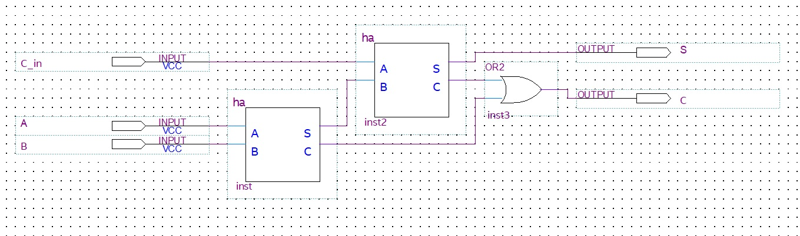

Nesse texto pretendo dar uma primeira introdução à implementação de circuitos
lógicos, implementando os componentes de uma unidade lógica e
aritmética, com um tutorial extra para implementação desses 
circuitos em
[FPGAs](https://pt.wikipedia.org/wiki/Arranjo_de_porta_program%C3%A1vel_em_campo),
dando uma  atenção exclusiva aos modelos Cyclone IV e V da Altera e fazendo toda a implementação no ambiente Intel Quartus Prime.

Os únicos pré-requisitos do texto são conhecer as operações
aritméticas básicas (isto eu não irei revisar) e ter
noções básicas de álgebra booliana. Sobre o último, farei uma breve
(re)visão no começo do texto e irei explicando detalhes mais sutis e
particulares no decorrer do texto.

A abordagem comicamente específica e estranha desse texto se dá
pelo fato de que esse texto foi escrito *especialmente* para servir de
material auxiliar para os alunos de um curso de Prática em Lógica
Digital no ICMC/USP, então todas as seções desse texto estão
associadas a um trabalho/aula do curso. Por esse mesmo motivo escolhi
considerar algumas noções de lógica digital como pré-requisito, já que
o curso de Introdução à Lógica Digital é dado simultaneamente a esse.
Se você não está fazendo esse curso e caiu aqui de paraquedas,
provavelmente não vai gostar muito desse texto. Neste caso, recomendo o
[blog do Coert
Vonk](https://coertvonk.com/category/hw/building-math-circuits) sobre
o assunto, alguns vídeos do [Ben Eater](https://www.youtube.com/watch?v=wvJc9CZcvBc)
no YouTube e a referência [Stephen Brown, Fundamentals of Digital
Logic](https://www.amazon.com/Fundamentals-Digital-Logic-Verilog-Design/dp/0073380547),
que vai bem além no assunto.

**Aviso importante**: Muitos dos projetos do curso de Prática em Lógica Digital
(além de uma boa porção da teoria) também são explicados em vídeos 
gravados durante a pandemia de 2020 pelo professor [Denis Wolf](https://sites.icmc.usp.br/denis/). Você pode assistir
essas aulas [nesta playlist do YouTube](https://youtube.com/playlist?list=PL400nT9WA9li9LjGXqFKlHqRZxryRAomV).

**Aviso importante$\mathbf{^2}$**: Algumas seções do texto têm partes marcadas com **(!)**.
Isso indica que essas partes explicam um pouco mais profundamente
sobre aquele assunto/problema. Para os desesperados:
podem pular esses parágrafos e seguir o texto como um tutorial
"passo-a-passo" de como montar os circuitos (ainda assim, recomendo
muito que não ignore até a seção 5).

Finalmente, números em base binária serão escritos com o prefixo $0b$,
números em base hexadecimal serão escritos com o prefixo $0x$ e
números em base decimal serão escritos sem prefixo.

Enfim, enjoy it!

# Conteúdo

0. [Pré-requisitos](#pré-requisitos)
1. [Configuração do Quartus Prime](#configuração-do-quartus-prime)
2. [Simplificação de Expressão Lógica](#simplificação-de-expressão-lógica)
3. [Modelagem de Problema Prático](#modelagem-de-problema-prático)
4. [Modelagem de Problema Prático 2: Electric Boogaloo](#modelagem-de-problema-prático-2-electric-boogaloo)
5. [Display Hexadecimal de 7 segmentos](#display-hexadecimal-de-7-segmentos)
6. [Somador Completo](#somador-completo)
7. [Somador de 4 bits](#somador-de-4-bits)

Apêndice A. [Dicas sobre o Quartus](#a.-dicas-sobre-o-quartus)

## 0. Pré-requisitos **(!)**

Os pré-requisitos para este texto são conhecer e entender as operações aritméticas básicas (e a raíz quadrada)
e álgebra booliana instrumental. Esta seção tem como objetivo somente introduzir os
conceitos básicos de álgebra booliana.

Basicamente, a álgebra booliana que vamos precisar aqui é um conjunto 
de regras que vale pra algumas operações no conjunto
$\{0,1\}$. Daqui em diante, um elemento desse conjunto será chamado de *bit*,
do inglês, *binary digit*. Essas regras são definidas de modo a "capturar" as principais
propriedades de operações entre conjuntos (reunião, interseção e complemento). 
No contexto de lógica digital, é mais comum usar os conectivos lógicos para se referir a estas operações,
usando *OU/OR* para a reunião, *E/AND* para a interseção e *NÃO/NOT* para o complemento.

As duas coisas são equivalentes porque a reunião de dois conjuntos $A$ e
$B$ é o conjunto dos elementos que pertencem a $A$ **ou** a $B$, não
exclusivamente (ou seja, o elemento pode pertencer aos dois), a
interseção entre $A$ e $B$ é o conjunto dos elementos que pertencem a
$A$ **e** a $B$ e o complemento de um conjunto $A$ é o conjunto dos
elementos de um conjunto universo que **não** pertencem a $A$.

Durante todo o texto vamos usar o símbolo $+$ para representar a operação *OR*
e o símbolo $\cdot$ pra representar a operação *AND*. O complementar
de um valor $a$, ou seja, a operação *NOT* aplicada num valor $a$ será
denotada por $\overline{a}$.

A seguir estão as principais regras das operações citadas (você pode
encontrá-las em qualquer livro de lógica digital).

Para todo bit $x$, vale:

1. Se $x=0$, então $\overline{x}=1$
2. Se $x=1$, então $\overline{x}=0$
3. $x \cdot 0 = 0$
4. $x + 1 = 1$
5. $x \cdot 1 = x$
6. $x + 0 = x$
7. $x \cdot x = x$
8. $x + x = x$
9. $x \cdot \overline{x} = 0$
10. $x + \overline{x} = 1$
11. $\overline{\overline{x}} = x$

Na prática, a operação *NOT* inverte o valor de um bit, a operação *OR* retorna
um bit $1$ somente quando qualquer um dos operandos é $1$ e a operação *AND* retorna
um bit $1$ somente quando ambos os operandos são $1$.

Note que para toda regra desse tipo, você pode
trocar $0$ por $1$, $\cdot$ por $+$ e a regra continua
valendo, e vice-versa. Este é o princípio de dualidade.

Além dessas regras, temos que as operações *OR* e *AND* são comutativas
(a ordem dos fatores não importa) e também são associativas (não importa onde você coloca
os parênteses). Elas também são distributivas, mas diferente da soma e produto de números
reais, a soma também distribui sobre o produto, ou seja, pra todos os
bits $x$, $y$ e $z$, vale tanto $x \cdot (y+z) = x \cdot y + x
\cdot z$ quanto $x+(y \cdot z) = (x+y) \cdot (x+z)$.

Para terminar, vão aí algumas propriedades menos óbvias que podem ser
úteis.

Para todos os bits $x$, $y$ e $z$, vale:

1. $x+x \cdot y = x$ (Absorção)
2. $x \cdot y + x \cdot \overline{y} = x$ (Combinação)
3. $\overline{x \cdot y} = \overline{x} + \overline{y}$ (DeMorgan)
4. $x \cdot y + y \cdot z + \overline{x} \cdot z = x \cdot y +
\overline{x} \cdot z$ (Consenso)

Novamente, para cada uma dessas propriedades existe uma outra equivalente
obtida através do princípio de dualidade.

Este modelo matemático é útil pra projetar circuitos digitais porque
trabalharemos com sinais binários (aos quais se atribui os símbolos 0 e 1,
por convenção), e o que se tem para trabalhar são as portas
lógicas, que são componentes lógicos que têm o comportamento das operações
que apresentamos. Daqui em diante, trataremos operações binárias e portas
lógicas como uma única coisa.

Dessas portas lógicas básicas, pode-se criar outras portas lógicas
úteis em várias situações, como por exemplo, a *XOR* (*OU-exclusivo*), que é
definida por $x \oplus y = \overline{x} \cdot y + x \cdot
\overline{y}$.

As portas lógicas que usaremos muitas vezes serão ilustradas usando suas
representações em blocos. Para conhecer as figuras de algumas portas lógicas
comuns, acesse [a página da Wikipédia sobre portas lógicas](https://en.wikipedia.org/wiki/Logic_gate#Symbols).

Daqui em diante, denotaremos $x \cdot y$ por $xy$.

A principal aplicação destas definições que apresentamos é modelar a solução
de um problema usando funções boolianas, que são fundamentalmente combinações
destas operações que definimos sobre um número qualquer de variáveis com uma
saída que satisfaça a solução de um determinado prolema. Através das propriedades
das portas lógicas, podemos simplificar as expressões dessas funções, de modo a usar menos
portas lógicas pra obter a mesma saída para as funções. Mais adiante
usaremos métodos mais eficientes para simplificar expressões de funções
boolianas, de modo que poderemos garantir que a expressão está na sua forma mais
simplificada.

Dado um problema, o que deve ser feito primeiro é a separação de bits de entrada e 
bits de saída. Cada saída será definida por uma função booliana, que pode ter como
variáveis alguns dos bits de entrada. Em seguida, uma maneira de organizar e
determinar qual deve ser o comportamento de cada uma das funções de saída, pode-se usar
uma ferramenta chamada *tabela-verdade*, que consiste em uma tabela com uma coluna para
cada entrada e saída e $2^n$ linhas, onde $n$ é o número de entradas. O objetivo é preencher
cada linha com uma combinação possível de entradas e descrever qual deve ser o valor de cada
uma das saídas dada esta combinação de entrada. O número de linhas se dá pelo fato de que
o número de combinações possíveis de $n$ bits é $2^n$ (princípio fundamental de contagem).

Uma vez construída a tabela verdade do problema, podemos definir a função booliana de
uma saída como uma soma da combinação de entradas que produz o valor $1$ nesta saída.
No exemplo da figura acima, temos que $Z(A,B,C) = A \overline{B} C + AB\overline{C} +
ABC$. Através das propriedades das operações de soma e produto, temos que $Z =
AC(B+\overline{B})+AB\overline{C}$ (distributividade), então temos que $Z = AC+AB\overline{C}
= A(B\overline{C}+C) = A(B+C) = AB+AC$, como mostra o circuito lógico em blocos na figura.

## 1. Configuração do Quartus Prime

Todos os circuitos que fizermos durante o texto serão projetados no Quartus Prime com o intuito
de implementá-los nas FPGAs Cyclone IV e V disponíveis nos laboratórios do ICMC. O Quartus Prime
é um software da Intel que possui ferramentas de design de circuitos lógicos em blocos e de sintetização
desses circuitos, com extensões para as FPGAs Cyclone. Você pode baixar a versão gratuita do Quartus Prime 
no [website da Intel](https://www.intel.com.br/content/www/br/pt/products/details/fpga/development-tools/quartus-prime/resource.html).

Após a instalação do Quartus Prime, devemos criar um novo projeto para trabalharmos. A cada trabalho/aula, deve-se
criar um novo projeto. Não costuma ser boa ideia utilizar um único projeto do Quartus para todos os trabalhos do curso.
Para criar um novo projeto, abra o Quartus e clique em **New Project Wizard**.

Depois disso, clique em **Next** e insira o nome do projeto e a pasta onde o projeto será armazenado.
**Importante**: O Quartus Prime por padrão escolhe uma pasta protegida do sistema para armazenar o projeto.
Altere essa pasta e escolha uma pasta dos seus documentos ou área de trabalho, por exemplo.

Mantenha todas as configurações como estão até chegar na tela chamada **Family, Device & Board Settings**.
Nesta tela, você deve selecionar o modelo de FPGA que você está utilizando na seção **Available Devices**,
podendo pesquisar pelo modelo na caixa de busca **Name filter**. No momento em que este texto foi escrito,
as duas FPGAs disponíveis nos laboratórios do ICMC são a Altera Cyclone IV (placa grande) e a Altera Cyclone V
(placa pequena). Para facilitar, seguem os códigos de cada um desses modelos:

- **Cyclone IV**: EP4CE115F29C7
- **Cyclone V**: 5CEBA4F23C7

Então, clique em **Next** e **Finish**.

Após criar o projeto, para criar um arquivo de circuito em blocos, clique em **File**$\rightarrow$**New**
$\rightarrow$**Block Diagram/Schematic File**. Após realizar alterações nesse arquivo, lembre-se de salvar
com **CTRL+S**.

Agora, clicando no símbolo de porta lógica na barra de ferramentas do Quartus, você pode usar a *Symbol Tool*
para adicionar um componente lógico no seu circuito. Basta escrever o nome da porta lógica na caixa de busca. Um número após
o nome da porta lógica indica a quantidade de entradas (exemplos: *and2*, *and3*, *or2*, *not*, etc).

Clicando no botão *Pin Tool* ao lado da *Symbol Tool*, você pode adicionar uma nova entrada ou saída no seu
circuito. Uma única entrada desse tipo pode ser usada para representar múltiplos sinais. Mais detalhes sobre
como fazer isso no [apêndice A.4](#vetores-de-entradasaida).

Para testar o seu circuito na FPGA, você deve primeiro sintetizá-lo e compilá-lo num formato que o Quartus pode
escrever na FPGA. Para isso, clique no botão *Start Compilation* com ícone de play.

Caso haja mais de um circuito no seu projeto, você pode usar a barra de navegação do projeto ao lado esquerdo da
tela no modo *Files* para selecionar o circuito que deseja compilar, clicar com o botão direito e selecionar a opção
*Set as top-level entity*.

Após o final da compilação, você deve escrever o programa na FPGA, usando a ferramenta *Programmer*. Para isso, selecione
a ferramenta *Programmer* na barra superior do Quartus e selecione o driver *USB Blaster* para programação. Depois disso
é só clicar no botão *Start* e esperar que o Quartus programe a FPGA com o circuito que você compilou.

## 2. Simplificação de Expressão Lógica

Um primeiro exemplo de simplificação de função booliana é o da
seguinte expressão:

\begin{equation}
	Q(A,B,C) = \left(A \cdot B\right) + \left((B+C)\cdot(B\cdot C)\right)
\end{equation}

Na forma que está, essa função quando implementada precisaria de $5$
portas lógicas, mas é possível fazer algumas manipulações algébricas
para simplificá-la.

A partir de agora, usaremos a notação $AB = A \cdot B$.

**(!)** Imediatamente, pela distributividade do produto
sobre a soma, ficamos com $AB + BBC + BCC$,
que automaticamente simplifica pela propriedade "$xx = x$" para
$AB+BC+BC$, e analogamente, pela proriedade 
"$x + x = x$", simplifica finalmente para
\begin{equation}
	Q(A,B,C) = AB+BC = B(A+C) 
\end{equation}
utilizando agora somente $2$ portas lógicas.

Na figura acima está o a função $Q$ implementada com as portas lógicas
na forma de diagrama de blocos. O circuito que leva à saída *OUTPUT1* 
está na forma não-simplificada (leva $5$ portas lógicas), enquanto o circuito
que leva à saída *OUTPUT2* está na forma simplificada (leva $2$ portas
lógicas).

## 3. Modelagem de Problema Prático

Já que na hora de resolvermos problemas reais usando circuitos lógicos
não teremos inicialmente uma função booliana, mas sim um problema a
analisar para transformarmos numa expressão lógica, vamos tentar
implementar um circuito que resolve o problema de criar um sistema de
controle de um reservatório de água.

O reservatório é modelado da seguinte maneira: ele possui $3$
sensores, $3$ válvulas e $1$ alarme.
Denotaremos os sensores por $S_0$, $S_1$ e $S_2$, as válvulas por
$V_1$, $V_2$ e $V_3$ e o alarme por $A$.
Disso já podemos inferir que o
sistema possui $3$ entradas (sinais dos sensores) e $4$ saídas
(controle das válvulas e alarme). Além disso, o comportamento das
entradas e saídas devem satisfazer as seguintes condições:

- A válvula $V_1$ deve ser acionada quando o sensor $S_1$ indicar
  presença de água;
- A válvula $V_2$ deve ser acionada *somente* quando os sensores
  $S_1$ e $S_2$ indicarem a presença de água;
- A válvula $V_3$ deve ser acionada *somente* quando *nenhum* dos
  sensores indicar a presença de água;
- O alarme $A$ deve soar quando $S_1$ indicar presença de água sem
  $S_0$, ou quando $S_2$ indicar presença de água sem $S_1$ e/ou
  $S_0$.

Logo podemos ver que a válvula $V_1$ é a mais simples, já que ela deve
ser acionada incondicionalmente quando o sensor $S_1$ estiver com
sinal ativo. Então já podemos dizer que $V_1=S_1$, o que é a mesma
coisa de só conectar um fio direto do sensor $S_1$ na válvula $V_1$.

Já para a válvula $V_2$ ser ativada, é necessário que ambos os
sensores $S_1$ e $S_2$ estejam ativos, ou seja, $V_2 = S_1 S_2$.

Para a válvula $V_3$, é necessário que todos os sinais dos sensores
estejam desativados, então ficamos com $V_3 =
\overline{S_0}\,\overline{S_1}\,\overline{S_2}$. Pelo Teorema de
DeMorgan, também temos $V_3=\overline{S_0+S_1+S_2}$.

Já para o alarme, existem duas situações nas quais o alarme deve ser
ativado: quando $S_1$ estiver ativo e $S_0$ não estiver, isto é,
$\overline{S_0}S_1$, ou então quando $S_2$ estiver ativo e qualquer um
dos $S_0$ e $S_1$ não estiverem, ou seja,
$S_2\left(\overline{S_0}+\overline{S_1}\right)=\overline{S_0 S_1}S_2$.
Finalmente, já que queremos que em qualquer um dos casos o alarme
ative, queremos $A=\overline{S_0} S_1 + \overline{S_0 S_1}S_2$.

E numa situação de emergência, queremos que o reservatório seja
esvaziado, portanto devemos adicionar uma condição extra para a $V_3$,
fazendo-a desativar quando o alarme estiver ligado, e as outras
válvulas devem ativar quando o alarme estiver ligado. Então
sendo $V_1^\prime$, $V_2^\prime$ e $V_3^\prime$ as 
novas funções para as válvulas, temos
\begin{align}
&V_1^\prime = V_1 + A\\
&V_2^\prime = V_2 + A\\
&V_3^\prime = V_3 \overline{A}
\end{align}

Daí ficamos finalmente com o seguinte circuito

## 4. Modelagem de Problema Prático 2: Electric Boogaloo

Um segundo problema a ser modelado usando circuitos lógicos é o
comportamento de um robô móvel. O sistema de controle desse robô
possui $3$ sensores, direita, esquerda e frente ($D$, $E$ e $F$,
respectivamente) que ativam quando detectam um obstáculo, e um 
sistema de movimento com $3$ comandos, direita, esquerda e frente
($CD$, $CE$, e $CF$, respectivamente).

O comportamento do robô deve seguir as seguintes regras:

- O robô deve se mover para frente *sempre* que o sensor da frente não
  detectar nenhum obstáculo;
- O robô deve virar à esquerda quando o sensor da frente detectar um
  obstáculo e o da esquerda não;
- O robô deve virar à direita quando existir obstáculo na esquerda e
  não à direita, ou quando houver um obstáculo apenas na frente ou se
  houver um obstáculo na frente, direita e esquerda;

Bem, como a primeira regra explicita que o robô deve ir para a frente
*sempre* que o sensor $F$ não detectar obstáculos, imediatamente já
temos que $CF = \overline{F}$. Para que o robô vá para a esquerda,
primeiramente é necessário que haja obstáculo à frente, para não ferir
a primeira regra. Além disso, deve haver um obstáculo à direita e não
à esquerda. Ficamos com $CE = \overline{E}DF$. Finalmente, para que o
robô vá para a direita, novamente, é necessário que o haja algum
obstáculo à frente, para não ferir a primeira regra.

Para o último controle $CD$, a dedução mais intuitiva da função não é
imediata, então vamos recorrer a outro método para deduzí-la. De
acordo com as regras dadas, segue a tabela verdade que o projeto deve
seguir:

| D | E | F | CD | CE | CF |
|---|---|---|----|----|----|
| 0 | 0 | 0 | 0  | 0  | 1  |
| 0 | 0 | 1 | 1  | 0  | 0  |
| 0 | 1 | 0 | 0  | 0  | 1  |
| 0 | 1 | 1 | 1  | 0  | 0  |
| 1 | 0 | 0 | 0  | 0  | 1  |
| 1 | 0 | 1 | 0  | 1  | 0  |
| 1 | 1 | 0 | 0  | 0  | 1  |
| 1 | 1 | 1 | 1  | 0  | 0  |

**(!)** Dessa tabela podemos escrever manualmente uma expressão que satisfaz a
coluna $CD$, que é $CD = \overline{D}\,\overline{E}\,F +
\overline{D}\,E\,F + DEF$ (soma de produtos).
Agora podemos simplificá-la. Distribuindo, temos $CD =
\overline{D}\,F\left(\overline{E}+E\right)+DEF$. Daí, temos 
$CD =\overline{D}\,F+DEF$.
Colocando $F$ em evidência, ficamos com $CD =
F\left(\overline{D}+DE\right)$, e agora, pela regra de absorção,
ficamos com $CD = F\left(E+\overline{D}\right)$.

Assim, circuito final fica da seguinte forma:

## 5. Display Hexadecimal de 7 segmentos

Passados os primeiros exemplos de circuitos lógicos, vamos para o
primeiro componente que vamos precisar para exibir os valores
numéricos nos componentes da ULA. A ideia do display hexadecimal de 7
segmentos é converter um número binário da forma $0bABCD$ em um dígito
hexadecimal $0xH$, onde $H$ é um dígito que pode assumir 16 valores, indo de
0 até 9 e então de A até F.

Para representar o dígito hexadecimal, usaremos o display de 7
segmentos disponível nas FPGAs Cyclone IV e V. A cada segmento do
display associaremos uma função booliana que leva os dígitos binários
de entrada ao sinal daquele segmento, de modo a desenhar todos os
dígitos hexadecimais possíveis. Para isso, primeiramente devemos construir uma
tabela-verdade com todos os valores possíveis para $0bABCD$ e suas respectivas
saídas, para que possamos construir os circuitos lógicos que representam cada
uma das 7 funções de saída.

Uma vez que a simplificação algébrica de 7 funções binárias de 4 variáveis
é um processo bastante longo e enfadonho, usaremos um método de simplificação
mais rápido para obter as expressões algébricas simplificadas. Este é o método
de *Mapas-K*, ou *Mapas de Karnaugh*. A descrição do método pode ser encontrada
[nesta página](https://de-abreu.github.io/be-a-ba/docs/logica-combinacional/o-mapa-de-karnaugh) escrita por alunos da
disciplina de Sistemas Digitais do ano de 2024.

Daqui em diante, todos os passos de simplificação algébrica são omitidos e
o leitor pode fazê-lo usando o método de Mapas-K.

**Muito importante**: os LEDs dos segmentos dos displays da FPGA são ativos em nível baixo,
isto é, cada LED aceso deve ter o sinal $0$ e cada LED apagado deve ter o sinal $1$.
Daí, as expressões algébricas para cada um dos 7 segmentos $S_0$, $S_1$, ..., $S_6$, na
ordem dos segmentos da FPGA, são:

- $S_0 = AB\overline{C}D+A\overline{B}CD+\overline{A}B\overline{C}\,\overline{D}+\overline{A}\,\overline{B}\,\overline{C}D$;
- $S_1 = AB\overline{D}+ACD+\overline{A}B\overline{C}D+BC\overline{D}$;
- $S_2 = ABC+AB\overline{D}+\overline{A}\,\overline{B}C\overline{D}$;
- $S_3 = A\overline{B}C\overline{D}+\overline{A}B\overline{C}\,\overline{D}+\overline{A}\,\overline{B}\,\overline{C}D+BCD$;
- $S_4 = \overline{A}B\overline{C}+\overline{A}D+\overline{B}\,\overline{C}D$;
- $S_5 = AB\overline{C}D+\overline{A}\,\overline{B}C+\overline{A}\,\overline{B}D+\overline{A}CD$;
- $S_6 = AB\overline{C}\,\overline{D}+\overline{A}BCD+\overline{A}\,\overline{B}\,\overline{C}$;

Para evitar erros no desenho dos blocos, é recomendável desenhar duas linhas
longas para cada entrada, uma invertida e a outra não, e então puxar os fios de cada
termo da expressão algébrica para uma porta *OR* de várias entradas.

## 6. Somador Completo

Falando finalmente em aritmética, o primeiro dos componentes de
aritmética que vamos implementar é o circuito *somador completo*
(full-adder). O somador completo é construído utilizando dois
*somadores parciais* (half-adder), portanto, começaremos por este. O
somador 'parcial' é um circuito que implementa duas funções booleanas:
a função $S$, que chamaremos de função *soma*, e a função $C$, que
chamaremos de função *carry*. A função soma leva um par de bits na
soma deles. Para todas os pares de bits exceto o par $(1,1)$, a soma é
trivial: $S(0,0)=0$; $S(0,1)=1$; $S(1,0)=1$. Para $S(1,1)$, como não é
possível representar o número $2$ utilizando somente um bit, definimos
$S(1,1)=0$ e ao mesmo tempo $C(1,1)=1$. Para todos os outros pares
$(A,B)$, temos $C(A,B)=0.$

Ficamos com a seguinte tabela-verdade:

| $A$ | $B$ | $C$ | $S$ |
| --- | --- | --- | --- |
| $0$ | $0$ | $0$ | $0$ |
| $0$ | $1$ | $0$ | $1$ |
| $1$ | $0$ | $0$ | $1$ |
| $1$ | $1$ | $1$ | $0$ |

De fato,
\begin{align}
	&0+0=0=0b00 \\
	&0+1=1+0=1=0b01 \\
	&1+1=2=0b10
\end{align}

As expressões para as funções $S$ e $C$ podem ser deduzidas
imediatamente pela tabela-verdade, pelo método de mintermos ou usando
mapas-K. Ficamos com o seguinte:
\begin{align}
	&S(A,B)=A \oplus B \\
	&C(A,B)=AB
\end{align}

**(!)** A ideia da função carry está relacionada com o sistema
posicional de representação de números inteiros que estamos usando.
A expressão $N=0ba_1 a_0$ que utilizamos para representar um número na
base $2$, de fato significa $N=a_1\cdot2 + a_0$, onde $a_1$ e $a_0$
são valores em $\{0,1\}$. O papel do carry
é garantir que a soma esteja bem definida em casos como $S(1,1)$. Já
que o número 2 não pode ser representado por nenhum dos coeficientes $a_1$ e
$a_0$, podemos usar o fato de que $2 = 1\cdot2 + 0 = 0b10$ para
"passar" o bit excedente adiante, com $a_1=1$ e $a_0=0$. A partir de
agora, podemos entender o somador parcial como uma função $HA(A,B)$,
que leva um par de bits em um vetor de dois bits cujas componentes indicam a
representação posicional do resultado da soma parcial.

**(!)** Note que o maior valor de $N=a_1\cdot2 + a_0$ é $3=0b11$, que ocorre
quando $a_1=a_0=1$ não é resultado de nenhuma soma parcial da
forma que definimos. Para considerar este caso, devemos adicionar uma
nova variável ao nosso circuito, que deve ser somada ao resultado
final. Essa nova função "extendida" é o *somador completo*. A
introduziremos a seguir e exploraremos um uso mais geral dessa nova
função na próxima seção.

O somador completo é uma função de três variáveis $FA(A,B,C_{in})$ que
leva suas três variáveis no vetor $(C,S)$ (*Carry-out* e soma). A terceira variável $C_{in}$ é
chamada de *Carry in* ($C_{in}$), por motivos que exploraremos melhor na próxima
seção. A tabela verdade do somador completo é a seguinte:

| $A$ | $B$ | $C_{in}$ | $C$ | $S$ |
| --- | --- | ---      | --- | --- |
|  0  |  0  |     0    |  0  |  0  |
|  0  |  0  |     1    |  0  |  1  |
|  0  |  1  |     0    |  0  |  1  |
|  0  |  1  |     1    |  1  |  0  |
|  1  |  0  |     0    |  0  |  1  |
|  1  |  0  |     1    |  1  |  0  |
|  1  |  1  |     0    |  1  |  0  |
|  1  |  1  |     1    |  1  |  1  |

Utilizando o métodos de Mapas-K, obtemos as seguintes expressões:

- $S = A \oplus B \oplus C_{in}$;
- $C = AC_{in}+AB+BC_{in}$;

Também é possivel escrever $FA$ em função de $HA$:

## 7. Somador de 4 bits

Na última seção construímos um circuito somador que nos permite somar 3
bits, então não é inesperado que em seguida tentassemos
generalizar esta ideia para somarmos mais bits. De fato, o que
queremos não é exatamente um circuito que nos permite somar $n$ bits,
mas sim um circuito que nos permite somar 2 números binários, onde ambos
possuem $n$ bits. Em particular, vamos olhar para o caso onde $n=4$, mas
a ideia é a mesma para o caso mais geral.

**(!)** Considere dois números inteiros positivos $A$ e $B$, e seja $n$ um
número maior que ou igual ao número de bits suficiente para representar tanto
$A$ quanto $B$ (isto é, $n \geq max\{\lceil log_2\,A\rceil, \lceil log_2\,B\rceil\})$.
Temos que $A+B = (A_{n-1} \cdot 2^{n-1} + A_{n-2} \cdot 2^{n-2} + \cdots + A_1 \cdot 2 + A_0)+$
$(B_{n-1} \cdot 2^{n-1} + B_{n-2} \cdot 2^{n-2} + \cdots + B_1 \cdot 2 + B_0)$ pode ser
reescrito, usando as regras de associatividade e distributividade, na forma
$A+B = (A_{n-1}+B_{n-1}) \cdot 2^{n-1} + (A_{n-2}+B_{n-2}) \cdot 2^{n-2} + \cdots +$
$(A_1 + B_1) \cdot 2 + (A_0 + B_0)$.Ou seja, de fato, podemos somar o $i$-ésimo bit
do primeiro operando com o $i$-ésimo bit do segundo operando para formar o $i$-ésimo
bit da soma deles, com o detalhe de que devemos considerar a seguinte noção que vimos durante
a motivação do *somador completo*, caso $(A_i+B_i)=2$, consideramos $(A+B)_i=0$ e
$(A+B)_{i-1} = (A_{i-1} + B_{i-1}+1)$. Essa definição recursiva é uma generalização
da noção de *carry* que vimos anteriormente. De fato, essa noção também é o mesmo princípio
usado na soma longa de números em base 10 que é ensinada no ensino fundamental.

Disso, podemos concluir que dados dois números de $n$ bits, podemos somá-los somando cada
respectivo bit de cada um, e propagando o bit de *carry* da forma recursiva definida anteriormente.
Isso é equivalente, na prática, a conectar $n$ somadores completos em série, onde o $i$-ésimo
somador completo recebe como entradas os $i$-ésimos bits dos operandos, e o bit de *carry* do
somador anterior. O primeiro somador completo recebe o bit $0$ como entrada de $C_{in}$. A soma
de cada somador completo representará o respectivo bit da soma dos números de entrada. Caso o último
somador completo emita um bit de *carry*, isso indica que $n$ bits não são suficientes para representar
a soma dos números $(\lceil log_2(A+B) \rceil > n)$. Este caso será chamado de *overflow*.

(demais seções em construção)...

## A. Dicas Sobre o Quartus

O Quartus Prime pode ser um pouco duro às vezes, por isso, aqui está uma
lista de dicas para facilitar o processo de desenvolver os circuitos
e evitar bugs no Quartus.

### 1. Abrindo o projeto de forma segura

Evite abrir o Quartus Prime e então abrir o projeto atrás de **File**$\rightarrow$
**Open Project**. É mais seguro acessar a pasta do seu projeto e clicar no ícone azul
do arquivo **.qpf** (Quartus Project File) do seu projeto para abrir o Quartus com o
seu projeto. Isso evita alguns bugs e crashes esporádicos no Quartus por motivos
misteriosos.

### 2. Fios sem-fio

Em projetos que têm muitas conexões entre os blocos, o diagrama de blocos pode ficar
bastante confuso e visualmente poluído. Uma maneira de mitigar isso é conectar blocos
sem usar 'fios' diretamente. Para isso, crie um pequeno fio em cada um dos blocos que
você deseja conectar, e então clique em cada um deles e dê um nome a eles (evite caracteres
especiais). O nome dos dois fios deve ser o mesmo.

Ao fazer isso, a ferramenta de síntese
do Quartus os conecta logicamente, mesmo que não haja um fio os conectando diretamente.

### 3. Criando blocos

Conforme os projetos ficam mais complexos, alguns circuitos são utilizados de forma repetida,
por exemplo, num somador de $n$ bits $n$ somadores completos são utilizados. Para facilitar
essa tarefa e tornar o projeto mais escalável, é possível transformar um diagrama de blocos
num bloco em si, tornando-o acessível através de **Symbol Tool**. Para isso, com o diagrama
de blocos aberto e salvo, clique em **File**$\rightarrow$**Create/Update**$\rightarrow$
**Create Symbol Files for Current File** e salve o arquivo. Agora você pode usar a **Symbol
Tool** para acessar o seu símbolo. **Importante**: Caso as entradas e/ou saídas do seu bloco
sejam alteradas, é necessário repetir o processo para atualizar o símbolo do bloco.

### 4. Vetores de entrada/saída

É comum que um circuito possua múltiplas entradas que dizem respeito
a uma só coisa, como por exemplo, num somador de 4 bits, as 4 entradas
$a_0$, $a_1$, $a_2$ e $a_3$ dizem respeito ao primeiro operador da soma.
O mesmo pode ocorrer para saídas. De fato, é possível 'agrupar' essas
entradas/saídas em um único símbolo de entrada/saída utilizando vetores.

Para criar um vetor de entrada/saída no Quartus, basta nomear uma
entrada/saída para *NOME[n-1..0]*, onde $n$ é o número de entradas
que você precisa. Dessa maneira, você pode usar um *fio de barramento*
para conectar essa entrada a outros símbolos que recebam entradas de
$n$ elementos, ou então utilizar os [fios sem-fio](#fios-sem-fio) para
utilizar somente uma das entrada (exemplo: nomear um fio de *NOME[0]*
utiliza a primeira entrada do vetor *NOME*).
